# 💳 حل مشكلة بوابة الدفع - CRITICAL FIX

---

## 📍 تحديد المشكلة الدقيقة

### الملف المتأثر
**`src/components/MoamalatRealLightbox.tsx` سطر 174**

```typescript
// ❌ المشكلة الحالية
const response = await fetch('http://localhost:4000/api/moamalat/hash', {
  method: 'POST',
  headers: { 'Content-Type': 'application/json' },
  body: JSON.stringify({
    Amount: params.Amount,
    DateTimeLocalTrxn: params.DateTimeLocalTrxn,
    MerchantId: params.MerchantId,
    MerchantReference: params.MerchantReference,
    TerminalId: params.TerminalId
  }),
});
```

### الأسباب

| السبب | التفسير | الحالة |
|------|---------|--------|
| **Server محلي** | `localhost:4000` موجود فقط على جهازك | ❌ لا يعمل على Vercel |
| **HTTP مش HTTPS** | بوابة الدفع تحتاج HTTPS | ❌ غير آمن |
| **لا توجد Database** | لا يوجد backend لحفظ البيانات | ❌ لا تطبيق للطلبات |
| **لا توجد API** | لا توجد endpoints منشورة | ❌ معطلة على الإنترنت |

---

## ✅ الحل الشامل

### الخطوة 1: إنشاء Backend على Express.js

```typescript
// src/controllers/paymentController.ts
import crypto from 'crypto';

export const generateMoamalatHashHandler = async (req, res) => {
  try {
    const { Amount, DateTimeLocalTrxn, MerchantId, MerchantReference, TerminalId } = req.body;
    
    // التحقق من البيانات
    if (!Amount || !DateTimeLocalTrxn || !MerchantId || !MerchantReference || !TerminalId) {
      return res.status(400).json({ error: 'Missing required fields' });
    }

    // توليد Hash
    const message = `Amount=${Amount}&DateTimeLocalTrxn=${DateTimeLocalTrxn}&MerchantId=${MerchantId}&MerchantReference=${MerchantReference}&TerminalId=${TerminalId}`;
    
    const hmac = crypto.createHmac('sha256', Buffer.from(process.env.MOAMALAT_SECRET, 'hex'));
    hmac.update(message);
    const secureHash = hmac.digest('hex').toUpperCase();

    // إرجاع الـ Hash
    res.json({ secureHash });
  } catch (error) {
    res.status(500).json({ error: error.message });
  }
};
```

### الخطوة 2: انشر على Railway

```
1. أنشئ حساب على https://railway.app
2. أنشئ MySQL Database
3. اضبط Environment Variables
4. اربط مستودع GitHub أو ارفع الملفات
5. سيحصل على URL مثل: https://eishro-backend.railway.app
```

### الخطوة 3: حدّث Frontend

في `src/components/MoamalatRealLightbox.tsx`:

```typescript
// ✅ الحل الجديد
const BACKEND_URL = import.meta.env.VITE_BACKEND_URL || 'https://eishro-backend.railway.app';

const generateSecureHash = async (params: any) => {
  try {
    const response = await fetch(`${BACKEND_URL}/api/payments/moamalat/hash`, {
      method: 'POST',
      headers: { 'Content-Type': 'application/json' },
      body: JSON.stringify({
        Amount: params.Amount,
        DateTimeLocalTrxn: params.DateTimeLocalTrxn,
        MerchantId: params.MerchantId,
        MerchantReference: params.MerchantReference,
        TerminalId: params.TerminalId
      }),
    });

    if (!response.ok) {
      throw new Error('Failed to generate secure hash');
    }

    const data = await response.json();
    return data.secureHash;
  } catch (error) {
    console.error('Error generating secure hash:', error);
    throw error;
  }
};
```

### الخطوة 4: أضف Environment Variable إلى Vercel

في **Vercel Dashboard → Settings → Environment Variables**:

```
VITE_BACKEND_URL = https://eishro-backend.railway.app
```

---

## 📊 قبل وبعد المقارنة

### ❌ الحالة الحالية (معطلة)

```
┌─────────────────────────────────────────────┐
│ Vercel Frontend                             │
│ platform-eishro.vercel.app                  │
│                                              │
│  محاولة الاتصال بـ:                         │
│  http://localhost:4000/api/moamalat/hash   │
│  ↓ FAIL ❌                                  │
│  (Server محلي لا يعمل على الإنترنت)        │
└─────────────────────────────────────────────┘
  
الرسالة:
"تعذر فتح بوابة معاملات. يرجى المحاولة مرة أخرى."
```

### ✅ الحالة الجديدة (مصلحة)

```
┌──────────────────────────────────────────────┐
│ Vercel Frontend                              │
│ platform-eishro.vercel.app                   │
│                                               │
│  يتصل بـ:                                     │
│  https://eishro-backend.railway.app          │
│  /api/moamalat/hash                          │
│  ↓ SUCCESS ✅                                │
│  ↓ HTTPS                                     │
│  ↓ Secure Hash توليد                        │
│  ↓ Payment Process                           │
└──────────────────────────────────────────────┘
         ↓
   ┌─────────────────┐
   │ Railway Backend │
   ├─────────────────┤
   │ Node.js Express │
   │ TypeScript API  │
   │ MySQL Database  │
   └─────────────────┘
```

---

## 🔄 عملية الدفع الكاملة (بعد الإصلاح)

```mermaid
graph TD
    A["المستخدم يذهب للدفع"] --> B["Frontend يجمع البيانات"]
    B --> C["يرسل طلب للـ Backend"]
    C --> D{"هل البيانات صحيحة؟"}
    D -->|نعم| E["Backend يولد SecureHash"]
    D -->|لا| F["خطأ: بيانات ناقصة"]
    E --> G["Backend يرسل Hash للـ Frontend"]
    G --> H["Frontend يفتح Moamalat Lightbox"]
    H --> I["المستخدم يدخل بيانات البطاقة"]
    I --> J["Moamalat يتحقق من الدفع"]
    J --> K{"هل الدفع نجح؟"}
    K -->|نعم| L["✅ Payment Success"]
    K -->|لا| M["❌ Payment Failed"]
    L --> N["Backend يحفظ الطلب في Database"]
    N --> O["Frontend يعرض تأكيد"]
```



---

## 🧪 اختبار الحل

### 1. اختبار محلي قبل الانتشار

```bash
# شغّل Backend محلياً
npm run dev
# http://localhost:5000

# شغّل Frontend
npm run dev
# http://localhost:5173

# افتح المتصفح وجرّب الدفع
```

### 2. اختبار باستخدام Postman

```
POST https://eishro-backend.railway.app/api/payments/moamalat/hash

Headers:
{
  "Content-Type": "application/json"
}

Body:
{
  "Amount": "50000",
  "DateTimeLocalTrxn": "202511131000",
  "MerchantId": "10081014649",
  "MerchantReference": "TEST-001",
  "TerminalId": "99179395"
}

Response:
{
  "secureHash": "ABC123DEF456..."
}
```

### 3. اختبار على Vercel

```
1. اذهب لـ https://platform-eishro.vercel.app
2. أضف منتجات للسلة
3. اذهب للدفع
4. جرّب الدفع
5. يجب أن يفتح Moamalat Lightbox
```

---

## 🔒 الأمان والخصوصية

### حماية البيانات

```typescript
// ✅ Backend يتعامل مع البيانات الحساسة
- MOAMALAT_SECRET محفوظ على الخادم فقط
- لا ينقل للـ Frontend
- HTTPS encryption لجميع الاتصالات
- JWT Authentication
- Input Validation
```

### CORS Configuration

```typescript
// في Backend
app.use(cors({
  origin: 'https://platform-eishro.vercel.app',
  credentials: true,
  methods: ['GET', 'POST', 'PUT', 'DELETE']
}));
```

---

## 📈 متطلبات الموارد

| المورد | الحد الأدنى | الموصى | ملاحظات |
|--------|-----------|---------|---------|
| Backend CPU | 0.5 vCPU | 1 vCPU | Railway توفر مجاناً |
| Memory | 512 MB | 1 GB | كافي لـ Node.js |
| Database | 100 MB | 1 GB | Enough for orders |
| Bandwidth | 1 GB/month | 5 GB/month | Free tier |

---

## 🎯 Timeline الإصلاح

| المرحلة | المدة | ملاحظات |
|--------|------|---------|
| Setup Backend | 1 ساعة | Express + MySQL |
| Implement Endpoints | 2-3 ساعات | Payment + Orders |
| Deploy to Railway | 30 دقيقة | Automatic |
| Test & Fix | 1 ساعة | Postman + Browser |
| **الإجمالي** | **4-5 ساعات** | يمكن نفس اليوم |

---

## ✅ Verification Checklist

```
قبل الانطلاق:

□ Backend مُنشر على Railway
□ MySQL Database متصل
□ /health endpoint يستجيب
□ /api/payments/moamalat/hash يعمل
□ CORS مفعّل
□ Environment Variables محددة
□ Frontend يشير للـ Backend URL
□ اختبار الدفع يعمل محلياً
□ اختبار الدفع يعمل على Vercel
□ Moamalat Lightbox يفتح
□ Payment Success يعمل
```

---

## 🎉 النتيجة النهائية

```
✅ بعد هذا الحل:
- الدفع سيعمل من Vercel
- بوابة Moamalat ستفتح بنجاح
- المستخدمون يمكنهم الدفع بأمان
- الطلبات ستُحفظ في Database
- كل شيء يعمل production-ready
```

---

## 📞 في حالة المشاكل

### المشكلة: Hash generation يفشل

**الحل:**
```
1. تحقق من MOAMALAT_SECRET صحيح
2. تأكد من Amount بالصيغة الصحيحة (× 1000)
3. تحقق من DateTimeLocalTrxn بصيغة yyyymmddHHmm
```

### المشكلة: CORS Error

**الحل:**
```typescript
// في Backend app.ts
app.use(cors({
  origin: process.env.FRONTEND_URL,
  credentials: true
}));
```

### المشكلة: Database Connection Failed

**الحل:**
```
1. تحقق من DB_HOST و DB_PORT
2. تأكد من DB_USER و DB_PASSWORD صحيح
3. تحقق من اتصال الإنترنت
```

---

## 🚀 الخطوة التالية

**يتم تطبيق هذا الحل في Phase 3:**

1. إنشاء Express.js Backend ✅ (مخطط)
2. تطبيق Payment Hash Endpoint ✅ (مخطط)
3. نشر على Railway ✅ (موثق)
4. تحديث Frontend ✅ (موثق)
5. اختبار شامل ⏳ (يتم في Phase 3)

---

**Status: ✅ DOCUMENTED & READY FOR PHASE 3**

---

**Last Updated:** 2025-11-13  
**Estimated Implementation Time:** 4-5 ساعات  
**Difficulty Level:** متوسط  
**Impact:** حل 100% من مشكلة الدفع
