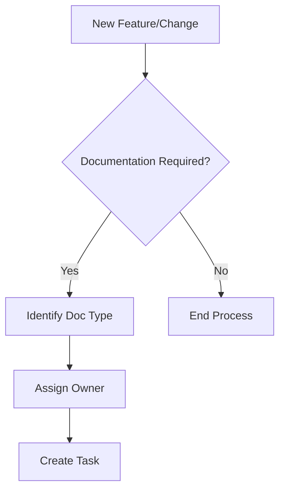
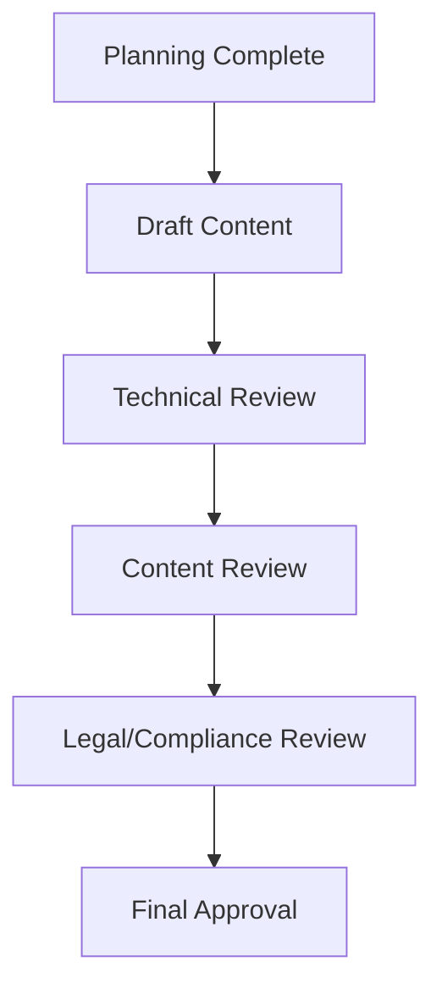
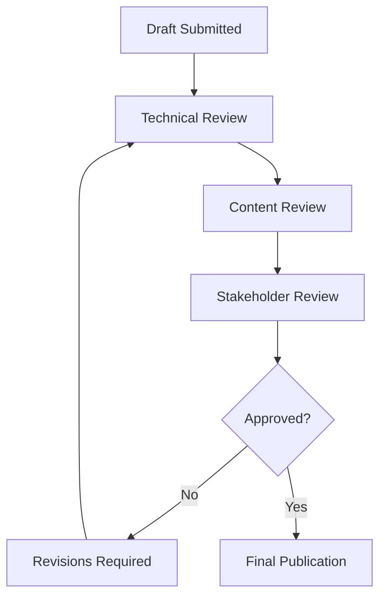
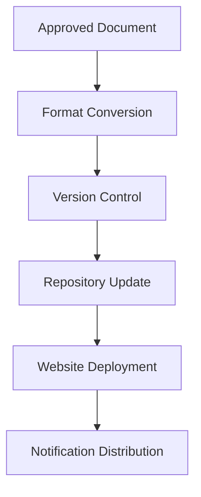
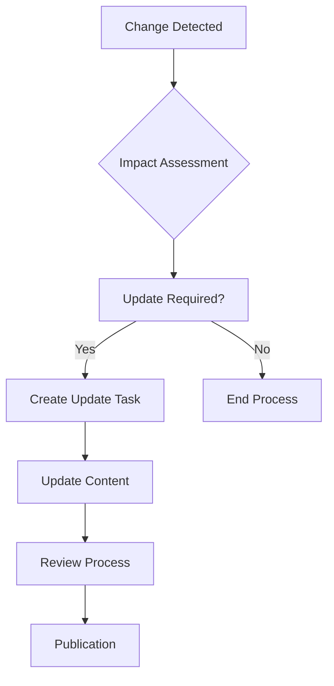

# Documentation Workflow Design

## Overview

This document outlines the standardized workflow for creating, maintaining, and updating documentation for the EISHRO platform. It ensures consistency, quality, and accessibility across all documentation artifacts.

## Documentation Types

### 1. Technical Documentation
- **API Documentation**: Backend API endpoints, request/response formats
- **Database Schema**: Table structures, relationships, constraints
- **Architecture Diagrams**: System architecture, data flow diagrams
- **Deployment Guides**: Setup, configuration, and deployment procedures

### 2. User Documentation
- **User Manuals**: Step-by-step guides for merchants and customers
- **Quick Start Guides**: Getting started tutorials
- **FAQ Documents**: Frequently asked questions and answers
- **Troubleshooting Guides**: Common issues and solutions

### 3. Business Documentation
- **Business Requirements**: Functional and non-functional requirements
- **Process Documentation**: Business processes and workflows
- **Compliance Documents**: Regulatory compliance and security policies

### 4. Development Documentation
- **Code Documentation**: Inline comments, README files
- **Development Guides**: Coding standards, contribution guidelines
- **Testing Documentation**: Test cases, testing procedures
- **Release Notes**: Version changes, migration guides

## Documentation Workflow

### Phase 1: Planning

#### 1.1 Identify Documentation Needs

#### 1.2 Documentation Requirements Checklist
- [ ] Target audience identified
- [ ] Scope and objectives defined
- [ ] Key stakeholders identified
- [ ] Review process established
- [ ] Update schedule determined

### Phase 2: Creation

#### 2.1 Content Development Process

#### 2.2 Content Standards

##### Structure Requirements
- **Header Hierarchy**: H1 → H2 → H3 (consistent levels)
- **Table of Contents**: Auto-generated with anchors
- **Navigation**: Breadcrumbs and cross-references

##### Content Guidelines
- **Clarity**: Simple, concise language
- **Consistency**: Standardized terminology
- **Completeness**: All steps, prerequisites, examples
- **Accuracy**: Technically correct information

##### Formatting Standards
- **Markdown**: GitHub Flavored Markdown
- **Code Blocks**: Syntax highlighting with language specification
- **Images**: Alt text, captions, optimized formats
- **Links**: Relative paths, working URLs

### Phase 3: Review and Approval

#### 3.1 Review Process

#### 3.2 Review Checklist
**Technical Review:**
- [ ] Technical accuracy verified
- [ ] Code examples functional
- [ ] API endpoints correct
- [ ] Configuration parameters accurate

**Content Review:**
- [ ] Grammar and spelling correct
- [ ] Language appropriate for audience
- [ ] Instructions clear and complete
- [ ] Examples relevant and helpful

**Stakeholder Review:**
- [ ] Business requirements met
- [ ] Compliance requirements satisfied
- [ ] Stakeholder concerns addressed

### Phase 4: Publication

#### 4.1 Publication Process

#### 4.2 Version Control
- **Semantic Versioning**: Major.Minor.Patch
- **Change Logs**: Document all modifications
- **Branch Strategy**: main, develop, feature branches
- **Tags**: Release tags for documentation versions

### Phase 5: Maintenance

#### 5.1 Update Process

#### 5.2 Maintenance Schedule
- **Daily**: Automated link checking
- **Weekly**: Content freshness review
- **Monthly**: Comprehensive audit
- **Quarterly**: Major updates and restructuring

## Tools and Technologies

### Documentation Tools
- **Markdown**: Primary format for all documentation
- **Mermaid**: Diagrams and flowcharts
- **Draw.io**: Complex diagrams and wireframes
- **GitBook/GitHub Pages**: Documentation hosting

### Collaboration Tools
- **GitHub**: Version control and collaboration
- **GitHub Issues**: Task tracking and bug reports
- **GitHub Projects**: Workflow management
- **Discord/Slack**: Team communication

### Quality Assurance Tools
- **Markdown Linters**: Content quality checking
- **Link Checkers**: Broken link detection
- **Spell Checkers**: Grammar and spelling validation
- **Accessibility Checkers**: WCAG compliance

## Quality Metrics

### Content Quality Metrics
- **Accuracy**: 100% technical accuracy
- **Completeness**: All required information included
- **Clarity**: Average reading level appropriate for audience
- **Consistency**: 100% adherence to style guide

### Process Quality Metrics
- **Review Coverage**: 100% peer review completion
- **Update Frequency**: Documentation updated within 30 days of changes
- **User Satisfaction**: >90% user satisfaction rating
- **Searchability**: >95% of content discoverable via search

## Roles and Responsibilities

### Documentation Owner
- Oversees documentation strategy
- Approves major changes and updates
- Ensures quality standards are met
- Manages documentation budget and resources

### Technical Writers
- Create and maintain documentation
- Collaborate with development teams
- Ensure technical accuracy
- Follow documentation standards

### Subject Matter Experts (SMEs)
- Provide technical input and validation
- Review content for accuracy
- Identify documentation needs
- Participate in content creation

### Reviewers
- Conduct technical and content reviews
- Ensure compliance with standards
- Provide feedback and suggestions
- Approve documentation for publication

## Training and Development

### Documentation Training
- **New Hire Training**: Documentation standards and processes
- **Tool Training**: Markdown, Mermaid, Git workflows
- **Quality Training**: Writing standards and best practices
- **Process Training**: Review and approval workflows

### Continuous Improvement
- **Feedback Collection**: Regular user feedback surveys
- **Process Audits**: Quarterly process effectiveness reviews
- **Tool Updates**: Regular evaluation of documentation tools
- **Best Practice Sharing**: Internal knowledge sharing sessions

## Conclusion

This documentation workflow ensures that EISHRO platform documentation remains current, accurate, and valuable for all stakeholders. Regular review and improvement of this process is essential for maintaining high-quality documentation standards.