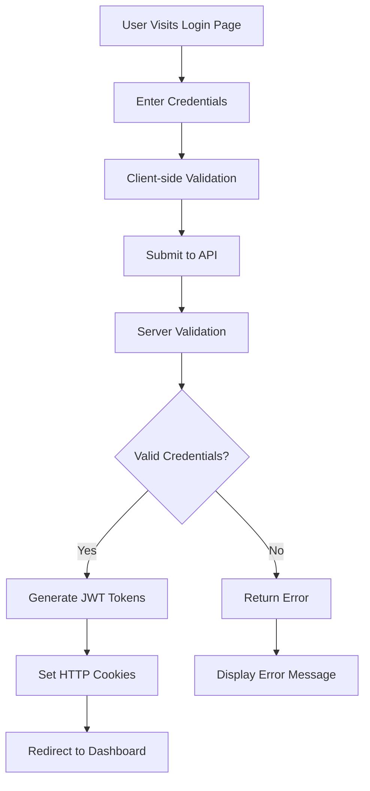
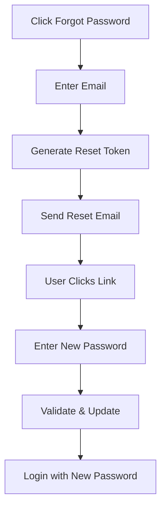

# Login User Document

## Overview

This document outlines the user authentication and login processes for the EISHRO platform, including security measures, user flows, and best practices for secure access.

## Authentication Architecture

### Security Features

#### Password Security
- **Hashing Algorithm**: bcrypt with 12 salt rounds
- **Minimum Requirements**:
  - Minimum 8 characters
  - At least one uppercase letter
  - At least one lowercase letter
  - At least one number
  - At least one special character
- **Password Reset**: Secure token-based reset process

#### JWT Token Management
- **Access Tokens**: 7-day expiration for active sessions
- **Refresh Tokens**: 30-day expiration for extended sessions
- **Token Storage**: HTTP-only cookies for web clients
- **Automatic Renewal**: Seamless token refresh without user intervention

#### Multi-Factor Authentication (Future)
- **SMS Verification**: Phone number verification
- **Email Verification**: Secondary email confirmation
- **App-based 2FA**: Authenticator app integration

## User Types and Access Levels

### 1. Customer Accounts
```typescript
interface CustomerAccess {
  role: 'customer';
  permissions: [
    'view_products',
    'place_orders',
    'manage_profile',
    'view_order_history',
    'manage_addresses'
  ];
}
```

### 2. Merchant Accounts
```typescript
interface MerchantAccess {
  role: 'merchant';
  permissions: [
    'customer_permissions',
    'manage_store',
    'manage_products',
    'manage_orders',
    'view_analytics',
    'manage_inventory'
  ];
}
```

### 3. Admin Accounts
```typescript
interface AdminAccess {
  role: 'admin';
  permissions: [
    'merchant_permissions',
    'manage_users',
    'system_configuration',
    'view_system_logs',
    'manage_payments',
    'platform_analytics'
  ];
}
```

## Login Process Flow

### Standard Login Flow


### Step-by-Step Login Process

#### 1. Access Login Page
- Navigate to `/login` or `/signin`
- Responsive design for mobile and desktop
- Arabic RTL support

#### 2. Credential Input
```html
<!-- Login Form Structure -->
<form id="loginForm">
  <div class="form-group">
    <label for="email">البريد الإلكتروني</label>
    <input type="email" id="email" required>
  </div>
  <div class="form-group">
    <label for="password">كلمة المرور</label>
    <input type="password" id="password" required>
  </div>
  <div class="form-options">
    <label>
      <input type="checkbox" id="remember"> تذكرني
    </label>
    <a href="/forgot-password">نسيت كلمة المرور؟</a>
  </div>
  <button type="submit">تسجيل الدخول</button>
</form>
```

#### 3. Client-side Validation
- Email format validation
- Password presence check
- Real-time feedback
- Arabic input support

#### 4. Server-side Authentication
```typescript
// Backend Authentication Logic
async function authenticateUser(email: string, password: string) {
  // 1. Find user by email
  const user = await User.findOne({ where: { email } });

  // 2. Verify user exists and is active
  if (!user || !user.isActive) {
    throw new Error('Invalid credentials');
  }

  // 3. Verify password
  const isValidPassword = await securityManager.verifyPassword(password, user.password);
  if (!isValidPassword) {
    throw new Error('Invalid credentials');
  }

  // 4. Update last login
  await user.update({ lastLogin: new Date() });

  // 5. Log successful login
  await auditLogger.log('user_login', {
    userId: user.id,
    email: user.email,
    ipAddress: request.ip,
    userAgent: request.get('User-Agent')
  });

  return user;
}
```

#### 5. Token Generation and Response
```typescript
// JWT Token Generation
const generateAuthTokens = (user: User) => {
  const accessToken = jwt.sign(
    {
      id: user.id,
      email: user.email,
      role: user.role
    },
    config.jwt.secret,
    { expiresIn: config.jwt.expire }
  );

  const refreshToken = jwt.sign(
    { id: user.id },
    config.jwt.refreshSecret,
    { expiresIn: config.jwt.refreshExpire }
  );

  return { accessToken, refreshToken };
};
```

## Password Reset Process

### Forgot Password Flow


### Security Measures
- **Token Expiration**: 1-hour validity for reset links
- **Single Use**: Tokens invalidated after use
- **Rate Limiting**: Maximum 3 reset requests per hour per IP
- **Audit Logging**: All reset attempts logged

## Session Management

### Session Lifecycle
```typescript
interface UserSession {
  id: string;
  userId: string;
  accessToken: string;
  refreshToken: string;
  createdAt: Date;
  expiresAt: Date;
  ipAddress: string;
  userAgent: string;
  isActive: boolean;
}
```

### Automatic Logout Triggers
- **Token Expiration**: Automatic logout on token expiry
- **Inactivity**: 30-minute inactivity timeout
- **Concurrent Sessions**: Maximum 5 active sessions per user
- **Security Events**: Logout on suspicious activity

### Session Monitoring
- **Real-time Tracking**: Active session monitoring
- **Device Management**: View and revoke sessions
- **Security Alerts**: Notifications for new device logins

## Security Best Practices

### For Users
1. **Strong Passwords**: Use complex, unique passwords
2. **Regular Updates**: Change passwords periodically
3. **Device Security**: Use trusted devices only
4. **Logout**: Always logout from public devices

### For Developers
1. **Input Validation**: Sanitize all user inputs
2. **Rate Limiting**: Implement request throttling
3. **Audit Logging**: Log all authentication events
4. **Token Security**: Use secure token storage

### For Administrators
1. **Access Control**: Implement role-based access
2. **Monitoring**: Regular security monitoring
3. **Incident Response**: Quick response to security events
4. **Compliance**: Maintain security compliance

## Error Handling

### Common Login Errors
```typescript
const loginErrors = {
  INVALID_CREDENTIALS: {
    code: 'INVALID_CREDENTIALS',
    message: 'البريد الإلكتروني أو كلمة المرور غير صحيحة',
    statusCode: 401
  },
  ACCOUNT_LOCKED: {
    code: 'ACCOUNT_LOCKED',
    message: 'تم قفل الحساب مؤقتاً بسبب محاولات تسجيل دخول فاشلة',
    statusCode: 423
  },
  EMAIL_NOT_VERIFIED: {
    code: 'EMAIL_NOT_VERIFIED',
    message: 'يرجى تأكيد البريد الإلكتروني أولاً',
    statusCode: 403
  }
};
```

### Account Lockout Policy
- **Failed Attempts**: 5 failed attempts trigger lockout
- **Lockout Duration**: Progressive (5min, 15min, 1hr, 24hr)
- **Reset**: Successful login resets counter
- **Notifications**: Email alerts for lockout events

## API Endpoints

### Authentication Endpoints
```
POST /api/auth/login
POST /api/auth/logout
POST /api/auth/refresh
POST /api/auth/forgot-password
POST /api/auth/reset-password
GET  /api/auth/me
```

### Request/Response Examples
```typescript
// Login Request
POST /api/auth/login
{
  "email": "user@example.com",
  "password": "SecurePass123!",
  "remember": true
}

// Login Response
{
  "success": true,
  "data": {
    "user": {
      "id": "uuid",
      "email": "user@example.com",
      "firstName": "John",
      "lastName": "Doe",
      "role": "customer"
    },
    "tokens": {
      "accessToken": "jwt_token_here",
      "refreshToken": "refresh_token_here",
      "expiresIn": 604800
    }
  }
}
```

## Monitoring and Analytics

### Authentication Metrics
- **Login Success Rate**: >95% success rate
- **Failed Login Attempts**: Track and analyze patterns
- **Session Duration**: Average user session time
- **Device Distribution**: Login sources and devices

### Security Monitoring
- **Suspicious Activity**: Real-time threat detection
- **Geographic Analysis**: Login location tracking
- **Time-based Patterns**: Unusual login times
- **Brute Force Detection**: Automated attack prevention

## Compliance and Regulations

### Data Protection
- **GDPR Compliance**: User data protection standards
- **Local Regulations**: Libyan data protection laws
- **Privacy Policy**: Transparent data usage policies

### Audit Requirements
- **Access Logs**: Comprehensive authentication logging
- **Data Retention**: Secure log storage and retention
- **Regular Audits**: Security and compliance audits

## Troubleshooting

### Common Issues
1. **Password Reset Not Working**
   - Check spam folder
   - Verify email address
   - Contact support if issues persist

2. **Account Locked**
   - Wait for lockout period to expire
   - Use password reset if needed
   - Contact support for immediate unlock

3. **Session Expired**
   - Refresh the page
   - Clear browser cache
   - Try logging in again

### Support Contact
- **Email**: support@eshro.ly
- **Phone**: +218 XX XXX XXXX
- **Live Chat**: Available 24/7 on platform
- **Help Center**: https://help.eshro.ly

## Future Enhancements

### Planned Features
- **Biometric Authentication**: Fingerprint and face recognition
- **Social Login**: Google, Facebook integration
- **SSO Integration**: Single sign-on for enterprises
- **Advanced MFA**: Hardware security keys

### Security Improvements
- **Zero-Knowledge Proofs**: Enhanced privacy protection
- **Blockchain Integration**: Decentralized identity
- **AI-powered Security**: Machine learning threat detection

This document provides comprehensive guidance for secure user authentication and login processes on the EISHRO platform.