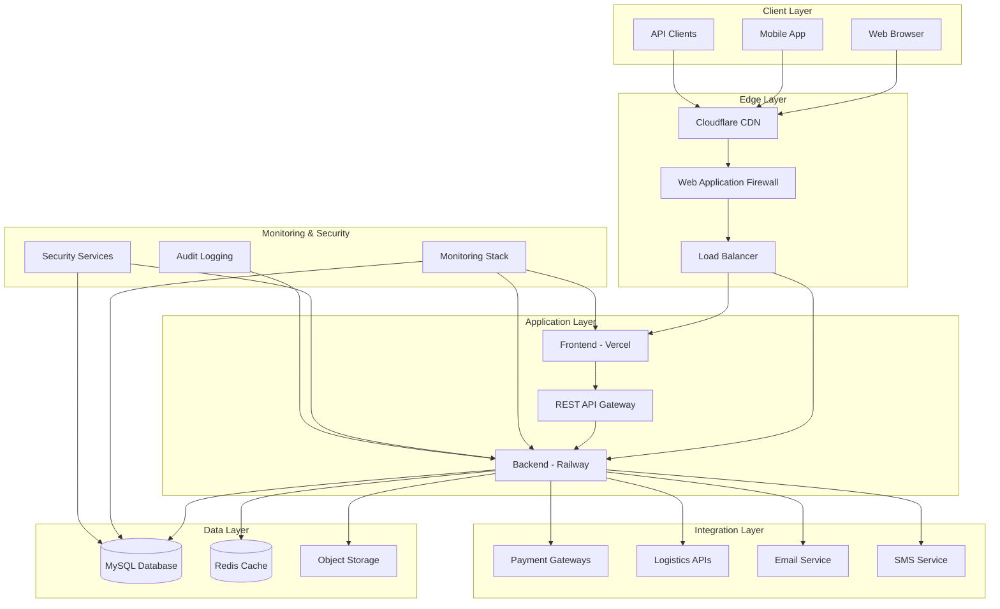
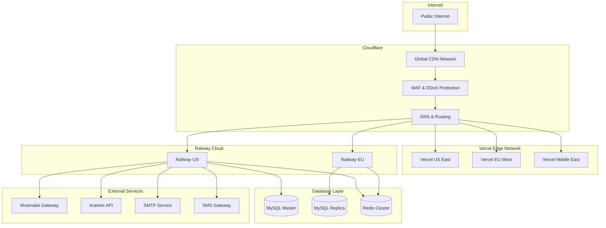
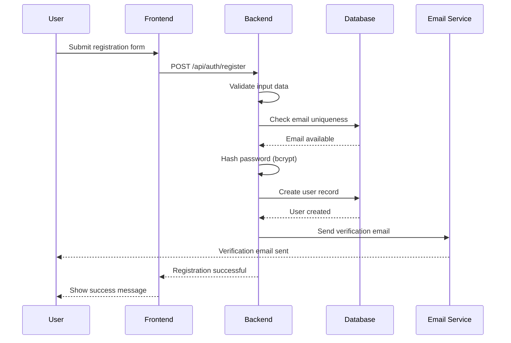
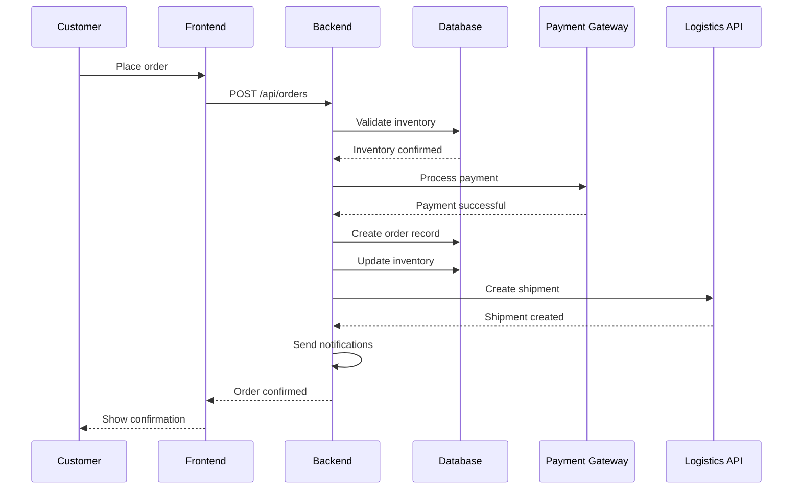
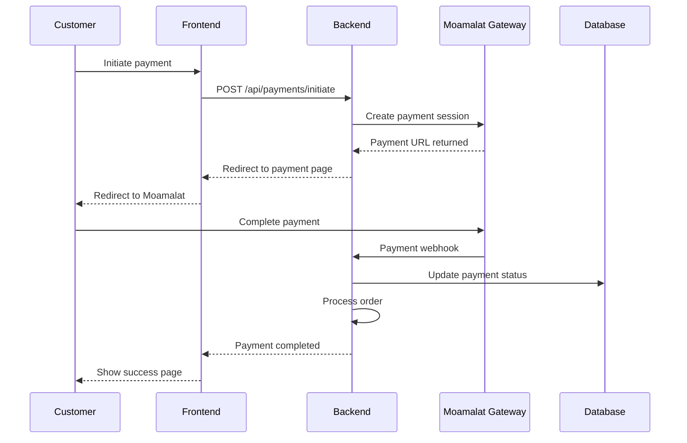
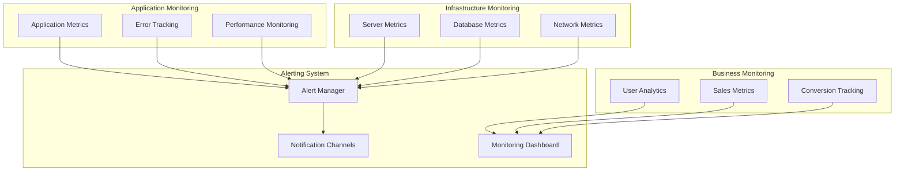
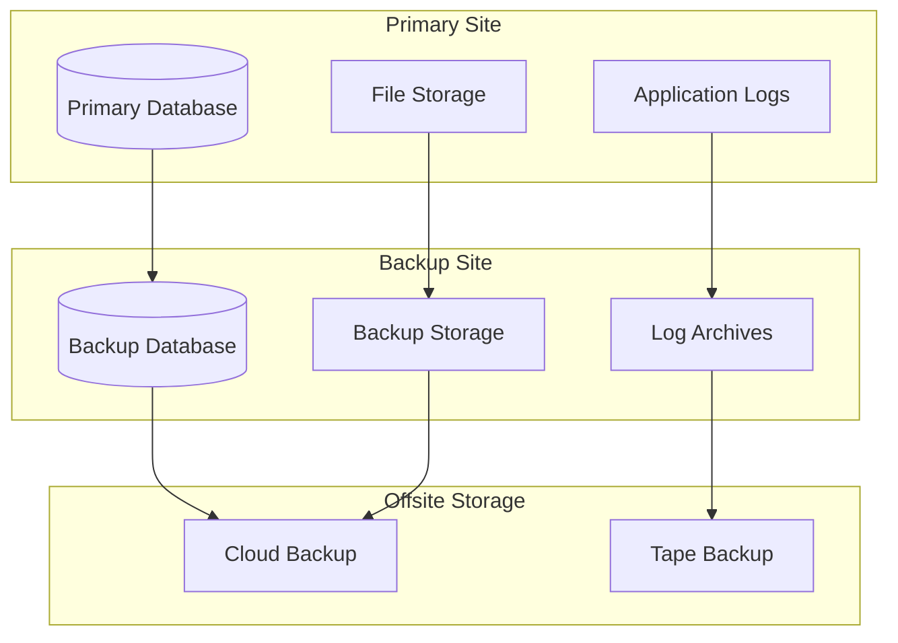
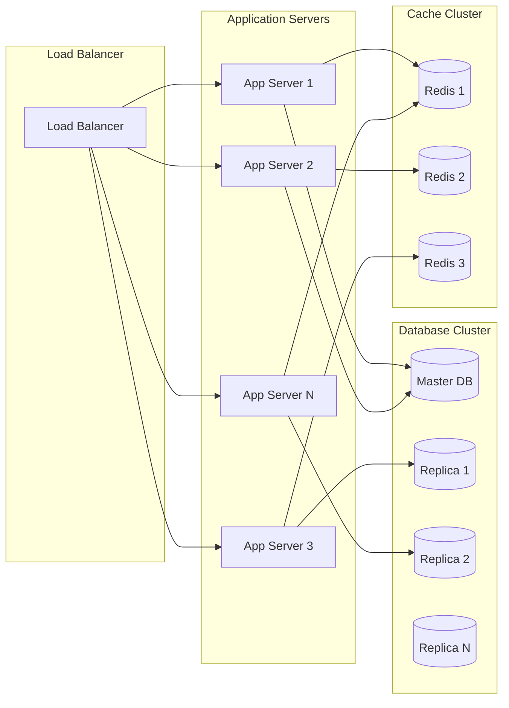

# Network Diagram & System Architecture

## Overview

This document provides a comprehensive view of the EISHRO platform's network architecture, system components, data flow patterns, and infrastructure topology. The architecture is designed for high availability, scalability, and security.

## System Architecture Overview

### High-Level Architecture


## Network Topology

### Production Network Architecture


## Component Details

### Frontend Layer (Vercel)

#### Architecture
```
Frontend Application Structure:
├── src/
│   ├── components/     # Reusable UI components
│   ├── pages/         # Page components
│   ├── hooks/         # Custom React hooks
│   ├── services/      # API service layer
│   ├── lib/           # Utility libraries
│   └── styles/        # Global styles
├── public/            # Static assets
└── dist/             # Build output
```

#### Network Configuration
- **Domains**: platform-eishro.vercel.app, eshro.ly
- **SSL**: Automatic HTTPS with Let's Encrypt
- **CDN**: Vercel Edge Network
- **Caching**: Static asset caching, ISR for dynamic content

### Backend Layer (Railway)

#### Service Architecture
```
Backend Application Structure:
├── src/
│   ├── config/        # Configuration files
│   ├── controllers/   # Request handlers
│   ├── models/        # Database models
│   ├── routes/        # API routes
│   ├── middleware/    # Express middleware
│   ├── services/      # Business logic
│   ├── utils/         # Utility functions
│   └── database/      # DB migrations & seeds
├── dist/             # Compiled JavaScript
└── logs/             # Application logs
```

#### API Gateway Configuration
```typescript
API Gateway Routes:
├── /api/v1/auth       # Authentication endpoints
├── /api/v1/users      # User management
├── /api/v1/stores     # Store management
├── /api/v1/products   # Product catalog
├── /api/v1/orders     # Order processing
├── /api/v1/payments   # Payment handling
└── /api/v1/analytics  # Reporting & analytics
```

### Database Layer

#### MySQL Architecture
```sql
Database Schema Overview:
├── users              # User accounts & profiles
├── stores             # Merchant stores
├── products           # Product catalog
├── product_images     # Product media
├── orders             # Customer orders
├── order_items        # Order line items
├── payments           # Payment transactions
├── coupons            # Discount coupons
├── user_addresses     # Shipping addresses
└── audit_logs         # Security audit trail
```

#### Connection Pooling
```typescript
Database Connection Configuration:
{
  host: process.env.DB_HOST,
  port: 3306,
  database: 'eishro_db',
  username: process.env.DB_USER,
  password: process.env.DB_PASSWORD,
  pool: {
    max: 20,           // Maximum connections
    min: 5,            // Minimum connections
    acquire: 30000,    // Connection timeout
    idle: 10000        // Idle timeout
  }
}
```

### Security Layer

#### Network Security

```mermaid
graph LR
    subgraph "Perimeter Security"
        WAF[Web Application Firewall]
        DDoS[DDoS Protection]
        SSL[SSL/TLS Termination]
    end

    subgraph "Application Security"
        AUTH[JWT Authentication]
        ACL[Access Control Lists]
        CORS[CORS Policy]
        RATE[Rate Limiting]
    end

    subgraph "Data Security"
        ENC[AES-256 Encryption]
        HASH[bcrypt Hashing]
        AUDIT[Audit Logging]
    end

    INTERNET --> WAF
    WAF --> DDoS
    DDoS --> SSL
    SSL --> AUTH
    AUTH --> ACL
    ACL --> CORS
    CORS --> RATE
    RATE --> ENC
    ENC --> HASH
    HASH --> AUDIT
```


#### Security Controls
- **Input Validation**: Joi schema validation
- **SQL Injection Prevention**: Parameterized queries
- **XSS Protection**: Content Security Policy (CSP)
- **CSRF Protection**: SameSite cookies, CSRF tokens
- **Rate Limiting**: 100 requests per 15 minutes per IP

## Data Flow Diagrams

### User Registration Flow


### Order Processing Flow


### Payment Processing Flow


## Infrastructure Monitoring

### Monitoring Architecture


### Key Monitoring Metrics
- **Application Performance**: Response times, error rates, throughput
- **Database Performance**: Query execution time, connection pool usage
- **Infrastructure Health**: CPU usage, memory usage, disk I/O
- **Security Events**: Failed login attempts, suspicious activities
- **Business Metrics**: User registrations, order volumes, revenue

## Disaster Recovery

### Backup Strategy


### Recovery Procedures
1. **Database Failover**: Automatic switch to replica within 30 seconds
2. **Application Recovery**: Container restart within 60 seconds
3. **Data Recovery**: Point-in-time recovery from backups
4. **Full System Recovery**: Complete restoration within 4 hours

## Scalability Design

### Horizontal Scaling


### Auto-Scaling Triggers
- **CPU Usage**: Scale up when >70% for 5 minutes
- **Memory Usage**: Scale up when >80% for 3 minutes
- **Request Queue**: Scale up when queue >100 requests
- **Database Connections**: Scale up when connections >80% of pool

## Compliance and Security

### Network Security Controls
- **Firewall Rules**: Restrict inbound/outbound traffic
- **Network Segmentation**: Isolate sensitive components
- **VPN Access**: Secure administrative access
- **Intrusion Detection**: Real-time threat monitoring

### Data Protection
- **Encryption in Transit**: TLS 1.3 for all communications
- **Encryption at Rest**: AES-256-GCM for database and files
- **Data Masking**: Sensitive data masking in logs
- **Backup Encryption**: Encrypted backup storage

## Performance Optimization

### CDN Configuration
- **Edge Locations**: 200+ global edge locations
- **Caching Rules**: Static assets cached for 1 year
- **Dynamic Content**: ISR for frequently changing content
- **Image Optimization**: Automatic format conversion and compression

### Database Optimization
- **Indexing Strategy**: Composite indexes for common queries
- **Query Optimization**: EXPLAIN analysis for slow queries
- **Connection Pooling**: Efficient connection reuse
- **Read Replicas**: Offload read queries to replicas

## Conclusion

The EISHRO platform's network architecture is designed to provide high availability, scalability, and security while maintaining optimal performance. The multi-layered approach ensures that the platform can handle growth while maintaining reliability and user experience.

## Appendices

### Appendix A: Detailed Component Specifications
### Appendix B: Security Policy Document
### Appendix C: Disaster Recovery Plan
### Appendix D: Performance Benchmarks
### Appendix E: Network Configuration Scripts